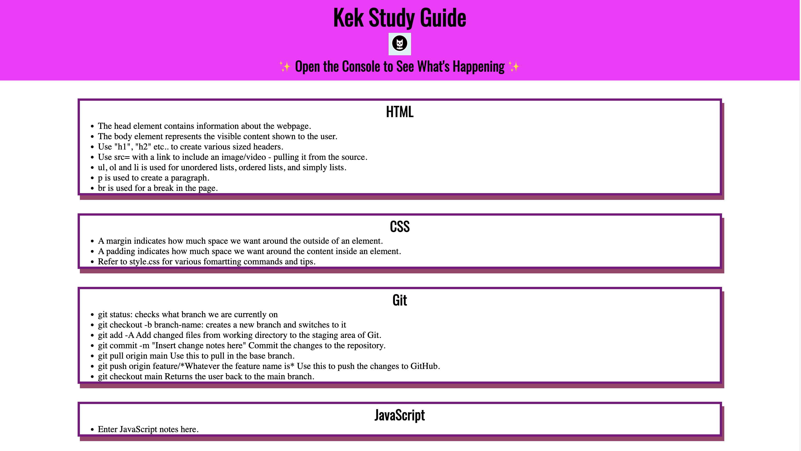

# prework-study-guide
A study guide for course pre-work.

# <prework-study-guide>

## Description

This webpage has been developed as a source of information that will help with my bootcamp study. Having this page as a reference tool will be highly beneficial to my learning, as I'll be able to refer back to the relevant information when needing help, or simply just some inspiration. Further, creating and developing a site like this has already kickstarted my learning experience, and has provided a solid base to build upon in the future.
I always like having a 'cheasheet' of sorts to help with my study, so it has been beneficial being able to incorporate my pre class work into building this tool. A problem that it solves is (personally) remembering simple functions and elements off the top of my head. Referring to this so that my syntax is correct will mean I will have less debugging to sort out later. 
Developing this web page has taught me the basics of Git, HTML, JavaScript, and CSS - essential tools for furthering my skills in the industry and setting me up for success within the bootcamp course!

## Table of Contents (Optional)

N/A

## Installation

N/A

## Usage

The usage of this webpage is simply to provide information and tools to refer to when working with HTML, CSS, Git, and JavaScript. The information on the website can be seen as a cheatsheet reference guide, that will benefit the user when working on their own software development projects. 

## Credits

N/A

## License

Please refer to the LICENSE in the repo.

---
